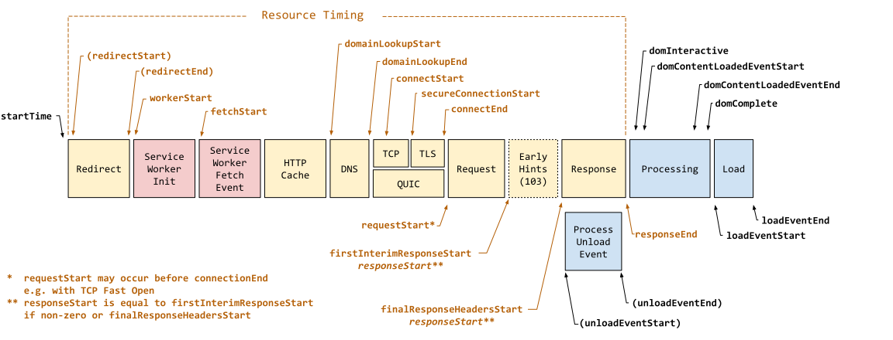

# Web Metrics

A lightweight utility for collecting and analyzing web performance metrics, such as navigation timing, paint timing, and user interaction metrics. This package helps developers monitor and optimize the performance of their web applications.

## Installation

To install the package, use npm or yarn:

```bash
npm install @esmj/web-metrics
# or
yarn add @esmj/web-metrics
```

## Why Use This Package?

- **Comprehensive Metrics**: Collects a wide range of performance metrics, including navigation timing, paint timing, and user interactions.
- **Lightweight**: Minimal overhead for performance monitoring.
- **Easy Integration**: Simple API for seamless integration into your web application.
- **Device Information**: Provides device-specific details such as screen dimensions and user agent.

## Usage

### Example

```typescript
import { measure, getMetrics } from '@esmj/web-metrics';

// Start measuring performance metrics
measure();

// Retrieve metrics after some time
setTimeout(() => {
  const metrics = getMetrics();
  console.log(metrics);
}, 5000);

// Or send the data to your server
if (typeof document !== 'undefined') {
  let sendToServer = false;

  document.addEventListener("visibilitychange", () => {
    if (document.visibilityState === "hidden" && !sendToServer) {
      sendToServer = true;
      const metrics = getMetrics();
      
      navigator?.sendBeacon(
        'your_server_url',
        new Blob([JSON.stringify(metrics)], { type: 'application/json' })
      );
    }
  });
}
```

### Data Structure

The `getMetrics` function returns `undefined` for unsupported environments or an object with the following structure:

```typescript
type Metrics = {
  navigation: {
    redirect: number | undefined;
    worker: number | undefined;
    appCache: number | undefined;
    DNS: number | undefined;
    TCP: number | undefined;
    TLS: number | undefined;
    QUIC: number | undefined;
    queueing: number | undefined;
    request: number | undefined;
    response: number | undefined;
    TTFB: number | undefined;
    HTML: number | undefined;
    resource: number | undefined;
    processingToDI: number | undefined;
    processingToDCL: number | undefined;
    processingDCL: number | undefined;
    processingToDC: number | undefined;
    processingL: number | undefined;
    processing: number | undefined;
    navigation: number | undefined;
    redirectCount: number | undefined;
    transferSize: number | undefined;
    decodedBodySize: number | undefined;
    type: string | undefined;
    name: string | undefined;
    FCP?: { value: number | undefined };
    FI?: { value: number | undefined };
    FID?: { value: number | undefined };
    LCP?: { value: number | undefined };
    CLS?: { value: number | undefined };
    INP?: { value: number | undefined };
  };
  device: {
    width: number;
    height: number;
    visibilityState: DocumentVisibilityState;
    bfcache: boolean;
    mobile: boolean;
    userAgent: string;
    connection?: {
      effectiveType: string | undefined;
      downlink: number | undefined;
      rtt: number | undefined;
      saveData?: boolean;
    };
  };
};
```
### Navigation Metrics Description

The `metrics.navigation` object contains the following values:

- **redirect**: Time spent on HTTP redirects.
- **worker**: Time spent initializing a service worker.
- **appCache**: Time spent checking the application cache.
- **DNS**: Time spent resolving the DNS.
- **TCP**: Time spent establishing a TCP connection.
- **TLS**: Time spent establishing a secure TLS connection.
- **QUIC**: Time spent establishing a QUIC connection.
- **queueing**: Time spent in the request queue.
- **request**: Time spent sending the request.
- **response**: Time spent receiving the response.
- **TTFB**: Time to First Byte, the time from the start of the request to the first byte of the response.
- **HTML**: Time spent downloading the HTML document.
- **resource**: Total time spent on the resource load.
- **processingToDI**: Time from the end of the response to the DOM Interactive event.
- **processingToDCL**: Time from DOM Interactive to DOM Content Loaded start.
- **processingDCL**: Time spent during the DOM Content Loaded event.
- **processingToDC**: Time from DOM Content Loaded end to DOM Complete.
- **processingL**: Time from the start of the load event to its completion.
- **processing**: Total time spent processing the page.
- **navigation**: Total time from the start of navigation to the load event end.
- **redirectCount**: Number of redirects during navigation.
- **transferSize**: Size of the transferred resources in bytes.
- **decodedBodySize**: Size of the decoded body in bytes.
- **type**: Type of navigation (e.g., `navigate`, `reload`, `back_forward`).
- **name**: Name of the navigation entry.



### Notes

- Use `getMetrics()` to retrieve the collected metrics at any point after initialization.
- For full functionality, the browser must support the `PerformanceObserver` API.
- The Safari browser is not supported because most metrics are unreliable.

## Comparison with `web-vitals`

The `@esmj/web-metrics` package and the `web-vitals` package both aim to provide tools for measuring web performance metrics. However, there are key differences in their features and use cases:

| Feature                          | `@esmj/web-metrics`                  | `web-vitals`                     |
|----------------------------------|--------------------------------------|----------------------------------|
| **Metrics Collected**            | Core Web Vital + Navigation timing, paint timing, user interaction metrics | Core Web Vitals |
| **Integration**                  | Simple API  | Simple API  |
| **Browser Support**              | Modern browsers with `PerformanceObserver` API (Safari not supported) | Modern browsers with `PerformanceObserver` API |
| **Package Size**                 | 1.2 KB (Minify + Gzip) | 2.21 KB (Minify + Gzip) |

## License

This package is licensed under the MIT License.